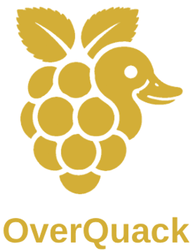
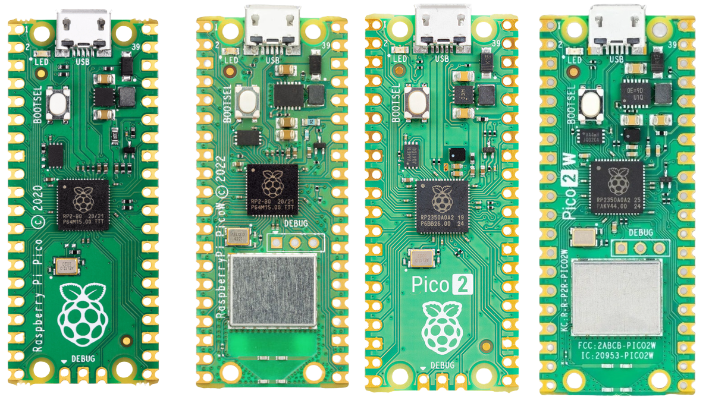
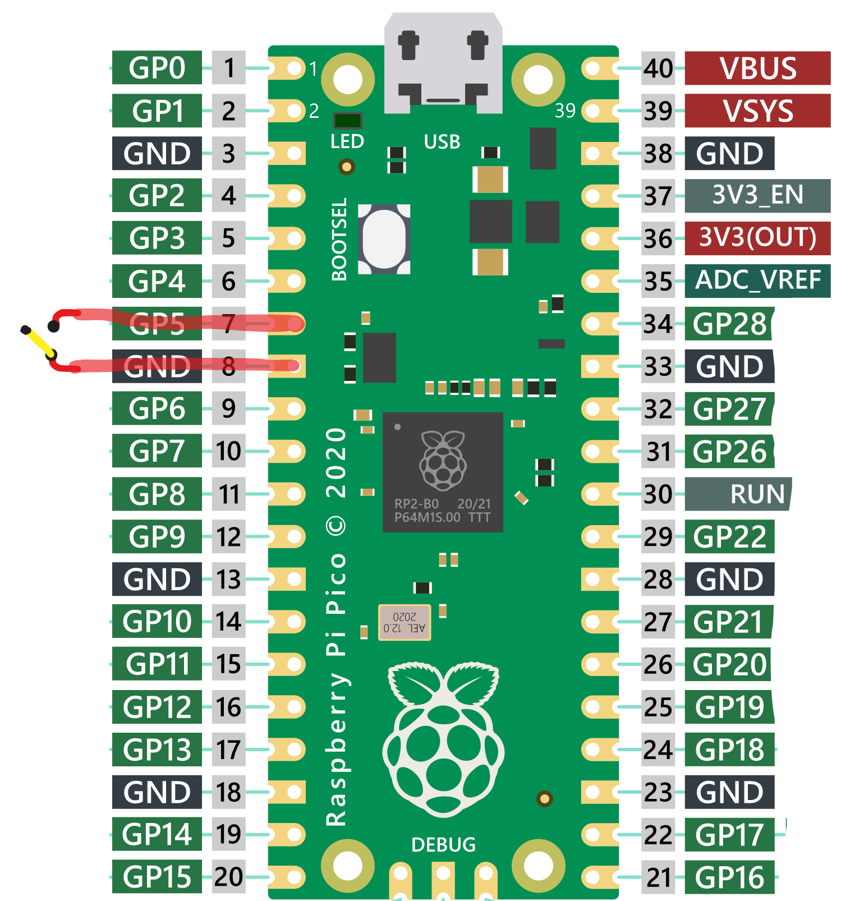
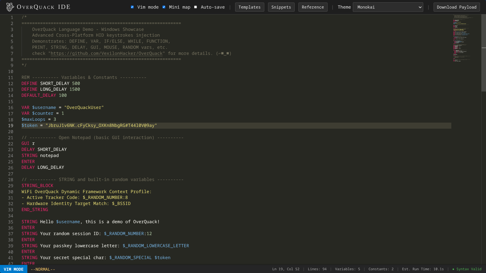
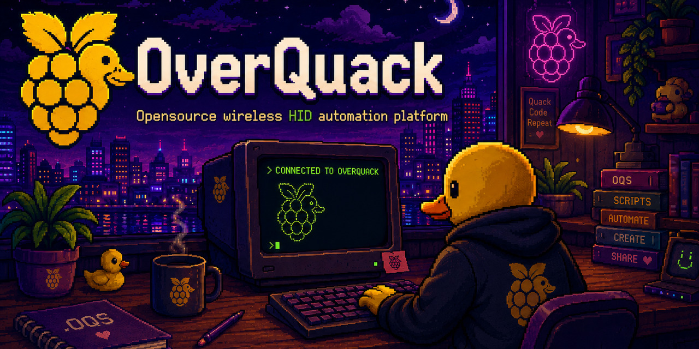

<p align="center">
  
</p>

<p align="center">
  <a href="#features-at-a-glance"><strong>✨ Features</strong></a> •
  <a href="#cross-platform-demos"><strong>🖥️ Demos</strong></a> •
  <a href="#quick-start"><strong>🏁 Quick Start</strong></a> •
  <a href="#configuration"><strong>⚙️ Config</strong></a> •
  <a href="#wireless-tcp-control"><strong>🌐 Wireless</strong></a> •
  <a href="#web-studio-ide"><strong>🖥️ IDE</strong></a> •
  <a href="#the-overquack-scripting-language-oqs"><strong>📜 Language</strong></a> •
  <a href="#roadmap"><strong>🗺️ Roadmap</strong></a>
</p>


## 🤔 Why OverQuack?

**OverQuack** is built for users who want a compact, flexible, and transparent platform for scripted HID automation.  
It brings together local payload execution, wireless management, a modern web IDE, and an extensible codebase that is easy to inspect and adapt.
<!-- i'll keep it as general better than comparing  -->

| What OverQuack offers | Typical commercial USB payload platforms |
|-----------------------|------------------------------------------|
| **Affordable hardware :** runs on Raspberry Pi Pico boards and variants | Usually sold as dedicated devices at a higher price point |
| **Open source, GPLv2 :** fully auditable, modifiable, and community-driven | Often closed source or only partially documented |
| **Full scripting language :** variables, functions, loops, math, randomisation, and more | Feature sets vary by platform and firmware |
| **Built-in Wi-Fi remote control :** wireless payload upload, execution, and management | Wireless control may require extra hardware or additional setup |
| **Web-based IDE :** live error checking, autocomplete, templates, snippets, and Vim mode | Some platforms provide editors or companion tools, but usually with a narrower workflow |
| **One-command installer :** streamlined setup across platforms | Setup can be more manual and device-specific |
| **USB personality switching :** change device behavior without replugging | Support varies by platform and firmware |
| **Multiple keyboard layouts :** switch layouts on the fly | Layout support is often available, but not always as flexible |
| **Mouse and consumer control :** move, click, scroll, and media keys | Often supported, though implementation differs |
| **Hackable and extensible :** easy to inspect, modify, and build on | Extensibility depends on whether the platform is open or locked down |
| **Designed for education and research :** clear behavior and transparent code | Many tools are intended for testing, but offer less visibility into internals |

> **OverQuack** combines the flexibility of DIY hardware with a polished workflow: scripting, wireless control, a browser-based IDE, simple installation, and configurable USB behavior in one compact platform. It is designed for people who value transparency, customization, and a modern development experience.

---
<a id="features-at-a-glance"></a>
## ✨ Features at a Glance

- 🧠 **Full DuckyScript extension**  variables, conditionals, loops, functions, math, randomisation
- 📡 **Wireless control**  built-in Wi-Fi access point and TCP server, deploy and trigger payloads remotely
- 🔌 **Plug and play HID injection**  keyboard, mouse, consumer controls (media keys). no drivers needed
- 🖱 **Full mouse support**  move, click, scroll, jiggle, and background jiggler
- 🔄 **USB mode switching**  HID, Storage, or HID+Storage, without unplugging
- 🖥️ **Cross-platform payloads**  works on Windows, macOS, and Linux
- ⚙️ **One-click setup**  guided cross-platform installer
- 🛠️ **Modular and hackable**  extend with new payloads, layouts, and tools; GPLv2.0 licensed
- ✅ **Fully configurable**  all settings live in `config.json`
- 🌐 **Rich desktop client**  interactive shell with auto-completion, history, and progress bars
- 🖥️ **Web-based IDE**  Monaco editor with syntax highlighting, live validation, templates and snippets
---

<a id="cross-platform-demos"></a>
## 🖥️ Cross-Platform Demos

<table align="center" style="width:100%; border-collapse:collapse;">
  <tr>
    <td align="center" style="width:50%;"><strong>🪟 Windows</strong></td>
    <td align="center" style="width:50%;"><strong>🍏 macOS</strong></td>
  </tr>
  <tr>
    <td align="center">
      <a href="./assets/OverQuack_Gifs/OverQuack_Win.gif" title="View full size">
        
      </a>
      <br><sub><strong>Windows 10: classic Notepad payload</strong></sub>
    </td>
    <td align="center">
      <a href="./assets/OverQuack_Gifs/OverQuack_MacOs.gif" title="View full size">
        
      </a>
      <br><sub><strong>macOS: Opening a Rick Roll in safari browser</strong></sub>
    </td>
  </tr>
  <tr>
    <td align="center"><strong>🐧 Linux</strong></td>
    <td align="center"><strong>📱 Android</strong></td>
  </tr>
  <tr>
    <td align="center">
      <a href="./assets/OverQuack_Gifs/OverQuack_Linux.gif" title="View full size">
        
      </a>
      <br><sub><strong>Arch Linux (bspwm): >:^]</strong></sub>
    </td>
    <td align="center">
      <a href="./assets/OverQuack_Gifs/OverQuack_Android.gif" title="View full size">
        
      </a>
      <br><sub><strong>Android (OTG): Opening a Rick Roll in brave browser</strong></sub>
    </td>
  </tr>
</table>

---

## 🧠 Supported Boards



<p align="center">
  OverQuack runs on the entire Raspberry Pi Pico family:<br>
  <strong>Pico</strong> · <strong>Pico W</strong> · <strong>Pico 2</strong> · <strong>Pico 2 W</strong>
</p>

## 🧠 Memory and Performance
**OverQuack** is tuned for long-running payloads, large scripts, and reliable remote operation.

<p align="center">
  <strong>Pico :</strong> 264 KB RAM andnbsp;|andnbsp;
  <strong>Pico W :</strong> 264 KB RAM andnbsp;|andnbsp;
  <strong>Pico 2 :</strong> 520 KB RAM andnbsp;|andnbsp;
  <strong>Pico 2 W :</strong> 520 KB RAM
</p>

> Stack size increased in **`OverQuack_src/settings.toml`** to handle deeply nested scripts, recursion, and complex payloads without crashing.


---
## 📦 Components

```bash
Overquack/
├── OverQauckInstaller.py               # Cross-platform setup wizard
├── OverQuack_src/                      # Pico firmware (runs on the board)
│   ├── boot.py                         # USB config and ATTACKMODE switching
│   ├── code.py                         # Startup and payload dispatcher
│   ├── overquackify.py                 # DuckScript interpreter (the brain)
│   ├── quackd.py                       # Wi-Fi TCP server
│   ├── config.json                     # Device configuration
│   ├── payload.oqs                     # Default payload (demo)
│   ├── settings.toml                   # CircuitPython runtime settings
│   └── lib/                            # HID libraries, keycodes, layouts
├── OverQuack_Client/                   # Desktop TCP client 
│   ├── overquack_client.py
│   ├── pyproject.toml
│   └── uv.lock
├── OverquackWebStudio/                 # Browser IDE 
│   ├── oqws_static
│   ├── oqws_template
│   ├── OverquackWebStudio.py
│   ├── pyproject.toml
│   └── uv.lock
├── OverQuack_Cirpy_firmwaresen_10.2.1/ # Precompiled CircuitPython firmwares
├── assets/
└── README.md
```

---

<a id="quick-start"></a>
## 🏁 Quick Start
### Automatic Installation (recommended)

Run the cross-platform installer:

```bash
python OverQauckInstaller.py
```

Then follow the interactive wizard. it will guide you through board selection, firmware flashing, and copying the OverQuack source files automatically.


### Manual Installation

1. **Download the repository**  
   Clone or download the [OverQuack repository](https://github.com/VexilonHacker/OverQuack).

2. **Enter BOOTSEL mode**  
   - Disconnect the Pico from USB.  
   - Hold the **BOOTSEL** button on the board.  
   - While holding BOOTSEL, plug the Pico into your computer.  
   - After 3 seconds, release the button.  
   - A USB drive will appear:  
     - **Pico / Pico W**: drive named **`RPI-RP2`**  
     - **Pico 2 / Pico 2 W**: drive named **`RP2350`**

3. **Nuke the flash** *(wipes all previous data -- essential for a clean setup)*  
   - Open the `OverQuack_Cirpy_firmwaresen_10.2.1/` folder in the repo.  
   - Copy the file `flash_nuke_all_boards.uf2` onto the BOOTSEL drive (`RPI-RP2` or `RP2350`).  
   - The board will automatically eject and reboot **back into BOOTSEL mode** (the same drive re-appears).

4. **Flash CircuitPython**  
   - From the same firmware folder, copy the **matching CircuitPython UF2** for your board.  
     | Board       | UF2 file |
     |-------------|----------|
     | Pico        | `adafruit-circuitpython-raspberry_pi_pico-en_US-10.2.1.uf2` |
     | Pico W      | `adafruit-circuitpython-raspberry_pi_pico_w-en_US-10.2.1.uf2` |
     | Pico 2      | `adafruit-circuitpython-raspberry_pi_pico2-en_US-10.2.1.uf2` |
     | Pico 2 W    | `adafruit-circuitpython-raspberry_pi_pico2_w-en_US-10.2.1.uf2` |
   - Drag the correct UF2 onto the BOOTSEL drive. The board will reboot again and now appear as **`CIRCUITPY`**.

5. **Install OverQuack**  
   - Copy **all files and folders** from the `OverQuack_src/` directory directly into the root of the `CIRCUITPY` drive.  
   - The drive should now contain `boot.py`, `code.py`, `overquackify.py`, `quackd.py`, `config.json`, `payload.oqs`, `settings.toml`, and the `lib/` folder.

6. **Done!**  
   - Safely eject the `CIRCUITPY` drive or simply wait a moment and the board will beready.  
   - Your OverQuack device is now prepared. Toggle switch and connect it to a target machine and it will run the default payload.

> Here is an example 


---

<a id="configuration"></a>
## ⚙️ Configuration

All device settings live in **`config.json`** on the `CIRCUITPY/OVERQUACK` drive. You can edit it directly while the Pico is in storage mode.

```json
{
  "DEFAULT_PAYLOAD" :  "payload.oqs",
  
  "DRIVE_LABEL": "OVERQUACK",
  "desc_DRIVE_LABEL": "Drive label will only change when you switch to attack mode",

  "ENABLE_SERIAL_DEBUG" : true,
  "desc_ENABLE_SERIAL_DEBUG": "Set to true for debug output on serial, false for silent operation",

  "BOARD" : {
    "controll_mode_pin": 5,
    "desc_controll_mode_pin" : "Setting GPIO pin that will change from keystroke mode to storage mode as example pin 2, 6, 10, 13...",

    "enable_auto_switch_mode" : true,
    "desc_enable_auto_switch_mode" : "switch attack mode without  need to replug usb",

    "enable_auto_reload" : false,
    "desc_enable_auto_reload" : "when editing a file in PICO and saving it, it will auto reboot PICO"
  },

  "AP" : {
    "ssid": "1984",
    "password": "OverQuackItBrother1984",
    "channel": "RANDOM",
    "desc_channel" : "You can set random channel  value by using RANDOM or specify channel value as int in range [1,13]",
    "ip_address": "10.10.5.1", 
    "ports": 1084,
    "desc_ports" : "TCP server port"
  },

  "USB_IDENTIFICATION": {
      "manufacturer": "CHICONY",
      "product": "HP Basic USB Keyboard",
      "vid": "0x03F0",
      "pid": "0x0024"
  }
}
```

### 🔄 USB Mode: Mass Storage ⇄ HID Keyboard

By default, the GPIO pin **`controll_mode_pin`** (GP5 in the example) determines the USB personality:
- **Pin connected to GND** -> HID attack mode (keyboard + mouse, no drive)
- **Pin floating (open)** -> Mass storage mode (drive visible for editing)

<!--  -->
<p align="center">
  
</p>

> 💡 With `"enable_auto_switch_mode": true` the device automatically reboots when you toggle the switch as no need to unplug!


---

<a id="wireless-tcp-control"></a>
## 🌐 Wireless TCP Control (Pico W / Pico 2 W)

**OverQuack** starts a Wi-Fi access point and a TCP server on port `1084`. You can control the device remotely using the **OverQuack Client**.

### Start the Client

```bash
cd OverQuack_Client
python -m venv .venv 
source .venv/bin/activate
pip install uv
uv sync 

python overquack_client.py --host 10.10.5.1 --port 1084
```
#### OverView


### Available Commands

| Command      | Description                                   |
|--------------|-----------------------------------------------|
| `ls`         | List all files on the device                  |
| `payloads`   | List all `.oqs` payloads                      |
| `read <f>`   | Display file content with syntax highlighting |
| `write <f>`  | Upload a payload (local file, pipe, or inline)|
| `delete <f>` | Delete a file                                 |
| `run <f>`    | Execute a payload immediately                 |
| `free_mem`   | Check free RAM                                |
| `wifi_scan`  | Scan nearby Wi-Fi networks                    |
| `get_config` | Download device configuration                 |
| `reboot`     | Reboot into normal / UF2 / safe mode          |
| `format`     | Wipe the entire filesystem                    |

The client also provides an interactive shell with auto-connection, history, and tab-completion of remote payloads.

---

<a id="web-studio-ide"></a>
## 🖥️ Web Studio IDE

A full-fledged **browser-based development environment** for writing OverQuack scripts.


Launch it locally:

```bash
cd OverquackWebStudio
python -m venv .venv 
source .venv/bin/activate
pip install uv
uv sync 

python OverquackWebStudio.py
```

Then open `http://localhost:1084` in your browser.

 
> 🌐 **Try it online:** [oqs.pythonanywhere.com](https://oqs.pythonanywhere.com/) 
### IDE Highlights

- **Monaco editor** with full Ducky-Script language definition
- **Syntax highlighting** and intelligent autocompletion (commands, variables, system vars, layouts)
- **Live error checking :** unknown tokens, unclosed blocks, unused variables/functions
- **Snippets library :** 100+ ready-to-use code blocks (Windows, loops, mouse, pranks...)
- **Templates :** full payload blueprints (reverse shell, persistence, Wi-Fi dump...)
- **Vim mode**, minimap, theme switcher
- **Drag and drop :** drop `.oqs`, `.txt`, `.dd`, `.duck` files to open them
- **Auto-save** to browser local storage
- **Download** payloads as `.oqs` files

---

<a id="the-overquack-scripting-language-oqs"></a>
## 📜 The OverQuack Scripting Language (OQS)

OverQuack supports a **superset of DuckyScript** with full programming capabilities, variables, functions, loops, mouse control, randomisation, and more.

> 📖 **Full language reference:** [LANGUAGE.md](LANGUAGE.md)  
> Includes every command, syntax examples, random value generators, layout switching, and a complete demonstration payload.

--- 
## 🔧 Advanced Topics

For power-users, developers, and anyone who wants to understand **exactly** how OverQuack works under the hood: ATTACKMODE resume, the TCP wire protocol, interpreter internals, memory tuning, adding layouts, and known limitations. see the dedicated deep-dive.

> 🧠 **Read the full guide:** [ADVANCED.md](ADVANCED.md)  
> Covers NVM-based resume, TCP framing, execution context stack, `$_JITTER` mechanics, USB spoofing, and more.

--- 

## ❓ FAQ and Troubleshooting

Got a question or a problem? The [FAQ.md](FAQ.md) covers the most common (maybe) issues. from boot loops and Wi-Fi connection problems, to ATTACKMODE resume quirks, NVM clearing, mobile device compatibility, and more.

> 🩺 **Check the FAQ first:** [FAQ.md](FAQ.md) 

---
## 📸 Community Showcase

Got a demo using OverQuack that deserves to be seen?  
Send your clip  with a short description and your handle to:   **[OverquackShowcase@proton.me](mailto:OverquackShowcase@proton.me)**  
The best ones make it into the [showcase](SHOWCASE.md) with full credit.

---

## 🔍 Serial Monitor / Debug View

You can watch live debug output (including `PRINT` statements) via serial connection.

### Linux / MacOS

```bash
# Install picocom pkg
x=0; while true; do [[ -e /dev/ttyACM0 ]] && picocom -b 9600 /dev/ttyACM0; ((++x)); printf '\n\033[1;37;41m[ %s | SESSION ENDED #%d ]\033[0m' "$(date '+%H:%M:%S')" "$x"; sleep 1; done
```

### Windows

1. Connect the Pico via USB.
2. Open **PuTTY** (or another terminal).
3. Choose **Serial**, enter the COM port (check Device Manager -> Ports), baud rate **9600**.
4. Start the session.

All `PRINT` messages are color-coded for easy reading.

---
<a id="roadmap"></a>
## 🗺️ roadmap
- [ ] **Bluetooth (BLE) control:** for Pico W and Pico 2 W
- [ ] **Encrypted TCP protocol:** for over-the-air security
- [ ] **Payload encryption on device**
- [ ] **Add arguments support in FUNCTION**
- [ ]  **Add Os detection variable**
- [ ] **File exfiltration via Caps Lock/Num Lock/Scroll Lock Reflection:** useful for air-gap systems [Original idea source](https://shop.hak5.org/blogs/usb-rubber-ducky/keystroke-reflection)
- [ ] **Pico boards as Keyboard middleman:** log keystrokes between USB keyboard and host using new circuitpython 10.2 CDC support
- [ ] **IDE improvements:** more validation rules, built-in serial monitor and binding OverquackWebStudio with OverQuack TCP client

---

## 🤝 Contributing

Contributions are welcome! Please open an issue or pull request. Stick to the **educational and ethical use** spirit of the project.

---
## 🫡 Acknowledgments

This project stands on the shoulders of giants.

- **Dave Bailey (dbisu)** created the original [pico-ducky](https://github.com/dbisu/pico-ducky), the foundation that OverQuack extends with advanced scripting, Wi‑Fi remote control, a web IDE, and much more.
- **Adafruit and the CircuitPython community** provide the incredible ecosystem that makes OverQuack possible, from the core interpreter and HID libraries to the `asyncio` module and the layout generator that powers all our keyboard layouts.

OverQuack exists because of open‑source collaboration.

---

## 📜 License

OverQuack is released under the **GNU General Public License v2.0**.  

---

## ⚠️ Disclaimer: Read This or Regret It

This tool is for **educational and ethical use only**.  
Do **not** use it for illegal activities, unauthorized access, or any harmful purpose.

The author is **not responsible** for any misuse, data loss, damage, or visits from law enforcement.

Use it **wisely** and only on systems you **own** or have **explicit, written permission** to test.

```
💻 + 🧠 = ✅
💻 + 🦆 + 😈 = 🚓
```

**Stay smart. Stay legal. Hack responsibly.**



